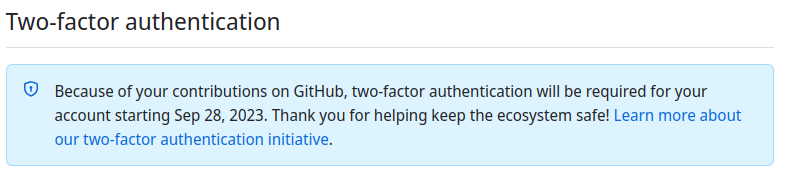

<table align="right" >
  <tr>
    <td>
    

      
      <dl>
       <dt><b>Shadertoy page</b></dt>
       <dd><a href="https://www.shadertoy.com/user/morimea" target="blank">shadertoy.com/user/morimea</a></dd>
       <dt><b>itch.io page</b></dt>
       <dd><a href="https://danilw.itch.io/" target="blank">danilw.itch.io</a></dd>
       <dt><b>Vulkan shadertoy launcher</b></dt>
       <dd><a href="https://github.com/danilw/vulkan-shadertoy-launcher" target="blank">vulkan-shadertoy-launcher</a></dd>
       <dt><b>Godot projects repository</b></dt>
       <dd><a href="https://github.com/danilw/godot-utils-and-other" target="blank">godot-utils-and-other</a></dd>
      </dl>
    

    
<a href="https://danilw.github.io/GLSL-howto/y.svg" target="blank" align="right" >y.svg</a>

    </td>
  </tr>
</table>

<h2 align="left">Hi there 👋</h2>
<h3 align="left">Graphic programming, GLSL and Godot projects.</h3>

      
📕 **Blog Posts**

- **[Float precision on GPU, bugs/features](https://arugl.medium.com/float-precision-on-gpu-bugs-features-178ddd030f)**
- **[Launching 619 thousand Tetris on GPU](https://medium.com/geekculture/launching-619-thousand-tetris-on-gpu-their-rendering-and-a-simple-bot-f2449b607db1)**
- **[Games in the GPU shaders](https://arugl.medium.com/games-in-the-gpu-shaders-a912414b1894)**
- **[Animations with shader programming](https://arugl.medium.com/examples-of-glsl-animations-2a82a64cb165)**
- [github mirror of medium blog](https://github.com/danilw/danilw.github.io/tree/master/blog)

Contact - **message me anywhere, I'll respond**.

Or `s48gs.w <at> gmail {dot} com`

<h2 align="left">Note 2023+:</h2>

**Since September 2023 I may not have access to this github account** for reason:

Github will force 2fa in September 2023 and I can not do it because [this reason](dx.png).
Contact email still should works, or look/search for other accounts where I will stay active.

