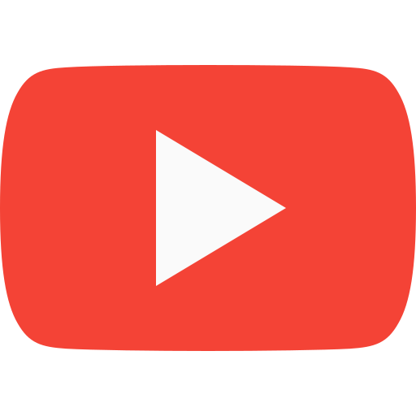

### Hi there 👋

<h3 align="left">Graphic programming, GLSL and Godot projects.</h3>

📕 **Blog Posts**

- [Float precision on GPU, bugs/features](https://arugl.medium.com/float-precision-on-gpu-bugs-features-178ddd030f) technical info
- [Launching 619 thousand Tetris on GPU](https://medium.com/geekculture/launching-619-thousand-tetris-on-gpu-their-rendering-and-a-simple-bot-f2449b607db1) one of my first shaders description
- [Games in the GPU shaders](https://arugl.medium.com/games-in-the-gpu-shaders-a912414b1894) links to my interactive GPU shaders, can be used as example of creating interactive stuff on the GPU
- [Animations with shader programming](https://arugl.medium.com/examples-of-glsl-animations-2a82a64cb165) list of my animations made using shaders, youtube and shaders links

🖼 **Visual presentation**

	 
	
	 

test
<svg version="1.1" xmlns="http://www.javatpoint.org/2000/svg"    xmlns:xlink="http://www.javatpoint.org/1999/xlink" width="500" height="500">
<image width="100" height="146" xlink:href="images/s/1.jpg" />
<animate attributeName="opacity" values="0;1;0" dur="4s" keyTimes="0;0.5;1" repeatCount="indefinite" />
</svg>  

Contact - message me anywhere, I'll respond.

<!--
**danilw/danilw** is a ✨ _special_ ✨ repository because its `README.md` (this file) appears on your GitHub profile.

Here are some ideas to get you started:

- 🔭 I’m currently working on ...
- 🌱 I’m currently learning ...
- 👯 I’m looking to collaborate on ...
- 🤔 I’m looking for help with ...
- 💬 Ask me about ...
- 📫 How to reach me: ...
- 😄 Pronouns: ...
- ⚡ Fun fact: ...
-->
